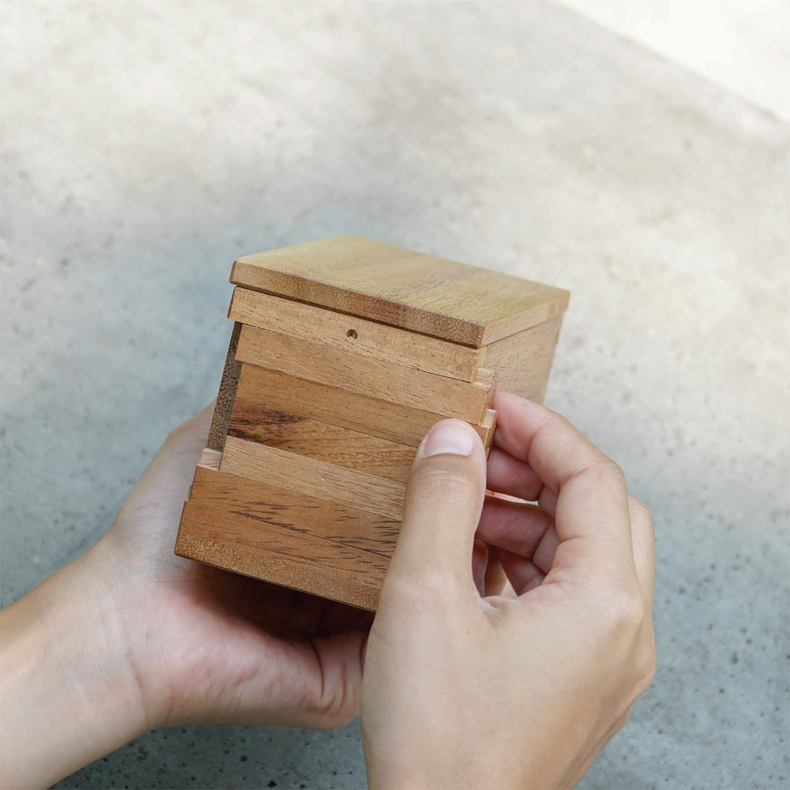

# [What's In the Box](https://youtu.be/1giVzxyoclE?t=134)!?
For Christmas, I was gifted a lovely alternative to wasteful wrapping paper that just ends up in the landfill: the [BSIRI Jigsaw Safe Box](https://www.amazon.com/Secret-Puzzles-Treasure-Compartment-Mystery/dp/B097RBFYC6). As can be seen in the image below, it features two plain sides, and two sides with five sliders each:



## The Problem Space
In order to open the box and get to the goody(ies) inside, each of the sliders needs to be in the proper position, exactly like the tumblers in a standard key-opened lock. There are three positions for each shelf:
1. Slid to the left; "Left"
2. Unmoved in the center; "Center"
3. Slid to the right; "Right"

In the image above, the first four sliders are in position "Right" and the bottom shelf is in position "Center": this is one of the possible solutions to unlock this side of the puzzle box (spoiler: it is not the solution for this side.)

### Antisymmetry
The two sides of the puzzle box are **not** unlocked by the same combination. This is not obvious, and it not advertised by the product description, but after having solved it, it turns out to be the case. Moreover, the two sides with sliders are identifiable as only one of the sides with sliders has an indented circle above the sliders: visible in the image above.

## The Math(s)
The set of positions for a given slider is $S=[\text{Left, Center, Right}]$. The **size** of $S$, a.k.a. the cardinality of $S$, is three, as there are three elements in $S$: the notation is $|S| = 3$.
Given that:
  - The sliders have the same set of positions, $S$,
  - The sliders' positions are independent of one another,
  - and that the sides' sliders are independent of each other,
  
there are the following number of solution configurations possible *for the side with a punched-in circle*:

$$ |\{\text{Top slider positions}\}|\cdot |\{\text{Second slider positions}\}| \cdot |\{\text{Third slider positions}\}| \cdot |\{\text{Fourth slider positions}\}| \cdot |\{\text{Fifth slider positions}\}| = $$

$$|S| \cdot |S| \cdot |S| \cdot |S| \cdot |S| = $$

$$ 3\cdot 3\cdot 3\cdot 3\cdot 3 =$$

$$ 3^5 = 243$$

The same is true for the opposite side of the puzzle box, the slider side **without** the punched-in circle. However, this does **not** simply halve the amount of possible configurations, as the two sides are independent; rather, the number of possible configurations is analagous to multiplying the number of configurations of the sliders by each other since those are independent: the two sides' number of slider configurations are multiplied by each other, giving us
$$\text{Total number of configurations} = 3^5 \cdot 3^5 = (3^5)^2 = 3^{10} = 59049$$
However, we know that, for our puzzle box, the two sides do not have the same unlocking configuration, so there is a non-zero amount of matching configurations in the two groups of 243 configurations. How many are there? Exactly as many as the amount of configurations for a given side, $3^5 = 243$! Therefore, **for this puzzle box**, the total number of configurations possible to unlock it is $$\text{Puzzle box slider configurations} = 3^{10} - 3^{5} = 3^5\cdot(3^5 -1) := C = 58806$$
*N.b. the $:=$ symbol means that a variable (in this case $C$) is being **defined** by the previous expression, or **initialized** to have a value.
## The Probability
The probability of naïvely hitting the exact configuration to unlock the box on the first try is $\frac{1}{3^{10} - 3^5} = \frac{1}{58,806} = 0.00001701$, which is about 17 in a million. This is what makes for such a good puzzle! Unless you don't like brute force algorithms, in which case all I can say is that the world's bicycle locks thank you for your lack of persistence!
## The Code
Writing anything fifty-eight thousand eight hundred six times would be a chore, nevermind listing subtle repetitions of the same three words. So, let's enlist the help of a computer. The following Python code will set up the objects discussed so far, and verify the counts and numbers claimed. There is no automation for solving the puzzle box in meat space, but running the provided code as one tries different combinations is an excellent companion to the solving process.
```python
>>> top_slider_configurations, second_slider_configurations, third_slider_configurations, \
    fourth_slider_configurations, fifth_slider_configurations = [("Left", "Center", "Right")] * 5
>>> top_slider_configurations
('Left', 'Center', 'Right')
>>> number_of_puzzle_box_side_configurations: int = 0
>>> for _ in top_slider_configurations:
        for _ in second_slider_configurations:
            for _ in third_slider_configurations:
                for _ in fourth_slider_configurations:
                    for _ in fourth_slider_configurations:
                        number_of_puzzle_box_side_configurations += 1
else:
    print(number_of_puzzle_box_side_configurations)
...
243
```
To not be overly verbose, we will use the `product()` function from the Python standard library module `itertools`: it creates the giant array (that we will call `puzzle_box_side_configurations`) that is belied by the code above: every collection of a configuration from each of the slider configurations. From *that* collection, we make an `itertools.product` object out of two copies of `puzzle_box_side_configurations`. Lastly, we filter out of that collection the configurations that are the same, and we are left with an object that has a two-tuple of puzzle box side configurations for each of the 58,806 possible configurations.
```python
>>> import itertools
>>> puzzle_box_side_configurations = list(itertools.product(top_slider_configurations, second_slider_configurations, third_slider_configurations, fourth_slider_configurations, fifth_slider_configurations))
>>> len(puzzle_box_side_configurations)
243
>>> total_configurations = itertools.product(puzzle_box_side_configurations, puzzle_box_side_configurations)
>>> puzzle_box_configurations = list(config for config in total_configurations if config[0] != config[1])
>>> C: int = len(puzzle_box_configurations)
>>> C
58806
```
## The Strategy
To best keep track of what one has and has not tried, use the `puzzle_box_configurations` object in a Python REPL: as `puzzle_box_configurations` is a Python `list` object, it has a `.pop()` method which discards its last element. So, the algorithm becomes:
  1. execute `puzzle_box_configurations.pop()`
  2. Read that configuration, set the physical puzzle box to that configuration, and try to open the box by gently pulling
  3. If the puzzle box opens, great! That's problem solved. If not, then go back to step `1.`

E.g.
```python
>>> puzzle_box_configurations.pop()
(('Right', 'Right', 'Right', 'Right', 'Right'), ('Right', 'Right', 'Right', 'Right', 'Center'))
```
meaning that the slider side with the inlaid circle would set all sliders to the right setting; and the reverse side would set all but the bottom slider to the right setting, and its bottom slider to the center setting.
### Alternative strategy
It is disheartening to think about whittling down a list of almost sixty thousand options, especially as checking each option requires physical manhandling of the puzzle box. Also, practically, it is difficult to hold 10 different sliding pieces of wood in the correct position while pulling on the top of the box.

So, we can split the problem into finding the correct configuration for each side of the puzzle in series. When I attempted the puzzle, I started with the side without the inlaid circle, but it is immaterial which is solved first and which second. In this situation, the strategy is the same, except that only 243 options are gone through: psychologically, this is somehow much more palatable. In code:
```python
>>> circle_side_configurations, plain_side_configurations = (puzzle_box_side_configurations, puzzle_box_side_configurations)
>>> circle_side_configurations.pop()
('Right', 'Right', 'Right', 'Right', 'Right')
>>> # This is not the correct configuration
>>> circle_side_configurations.pop()
('Right', 'Right', 'Right', 'Right', 'Center')
...
```
# Conclusion
This is a very lovely gift: it is constructed well and has a decent amount of space inside of it to store something valuable. I ended up needing somewhere around 100 attempts to solve first the side without the inlaid circle, and then several hundred attempts to solve the other side. So, all said, I lucked out in the problem space! This problem space also gave me a bit better intuition about the enormity of $2^{256}$, highlighted in a recent [video from 3Blue1Brown](https://www.youtube.com/watch?v=X4jpqCu-wlA). The problem space of this puzzle box is unimaginably smaller than that of 256-bit encryption, so we should rest assured that various computer operations should be secure for some time to come.

In the meantime, happy puzzling.
